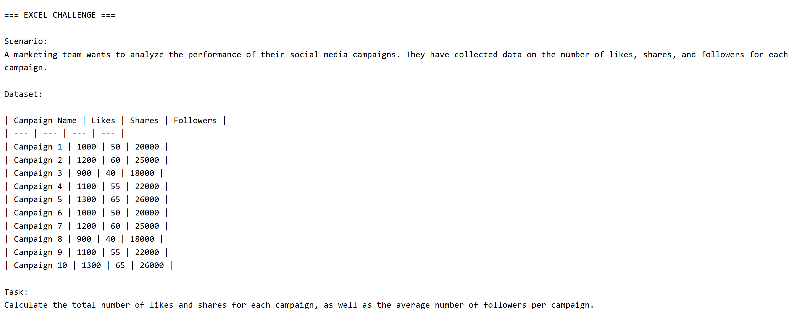

# 📊 AI Analytics Coach (Python Automation Project)

My Python automation project that delivers daily Excel and SQL challenges via email to systematically improve analytical skills.

This project was built as a hands-on way to learn Python while preparing for a career in Data Analytics.  

Instead of taking passive courses, I tried to solve a problem by developing a system that trains me everyday while learning a new skill.

---

## 🚀 What It Does

Every day automatically:

1. Generates Excel + SQL challenges using a local LLM
2. Structures problems by difficulty (Beginner → Intermediate → Professional)
3. Provide solutions for each problem using 3 different approaches 

(a. Biginner, b. Intermediate, c. Advance)


4. Sends the challenge to my inbox
5. Runs fully unattended in the cloud

**Result:** consistent daily analytics practice without manual effort.

---

## 🧠 Why I Built This

My goal is to transition into analytics roles.

I wanted to:

- Practice SQL and Excel daily
- Learn Python through real-world training
- Build something practical instead of tutorials
- Demonstrate problem solving + analytical thinking on GitHub

So I built my own automated training system.

---

## 🛠 Tools used

- Python 3.12
- Ollama (Runs localy on my machine)
- Gmail SMTP
- GitHub Actions (automation & scheduling)
- JSON for persistence

---

## 🏗 Architecture

### Local (monthly or on demand)
- Batch-generate 30+ days of challenges using Ollama
- Save results to `challenges.json`

### Cloud (daily)
- GitHub Actions runs a Python script
- Reads today's challenge
- Sends formatted email automatically

This hybrid design:
- avoids API costs by using local LLM
- runs even when my PC is off

---

## 📂 Project Structure

```
ai_agent_coach/
│
├── batch_generate.py      # generate many days locally
├── daily_sender.py        # send daily email (cloud-safe)
├── email_sender.py        # SMTP email utility
├── ollama_generator.py    # local AI generation
├── challenges.json        # saved challenges
├── main.py                # local testing runner
└── .github/workflows/     # daily automation config
```

Each file can be explored to understand python scripts.

---

## 📸 Sample Output


*Figure 1: A sample view of email sent by ai agent*

---
---

*Figure 2: Number of days and difficulty level for progress tracking.*


*Figure 3a: Excel challenge by agent, including a scenario, dataset and task.*


*Figure 3b: Excel solutoins using 3 different approaches.*

---


*Figure 4a: SQL challenge by ai agent incuding datasets.*


*Figure 4b: SQL solutions using 3 digfferent approaches.*


*Github cloud automation*


---

## 🎯 Skills Demonstrated

This project showcases:

- Python scripting
- Automation workflows
- Environment variables & secrets management
- SMTP email integration
- Local AI inference
- Problem-solving mindset

---

## 📘 What I Learned

Building this project helped me move beyond tutorials and understand how software systems actually work in practice.

Key takeaways:

- How Python executes scripts and manages program flow
- Writing reusable functions 
- Automating repetitive tasks with Python
- Sending emails via SMTP
- Managing environment variables securely
- Scheduling jobs using GitHub Actions
- Designing systems that run without manual intervention

Most importantly, I learned how to **use Python as a tool to solve practical problems**, not just write isolated scripts.

---
## 📬 Author

Built this project to practice my Excel and SQL Analytical skills on daily basis. I managed to learn Excel and SQL from different sources but I was lacking python. 

Since, all the Analytics professionls poses python skill too. I decided to go hands on with this project and learn Python while building this project. 

This project was more close to python used for programming than it is to analytics. I still have a lot to learn but this project helped me understand Python and developed my basics for further learning. 

Focused on learning by building real, practical systems.

